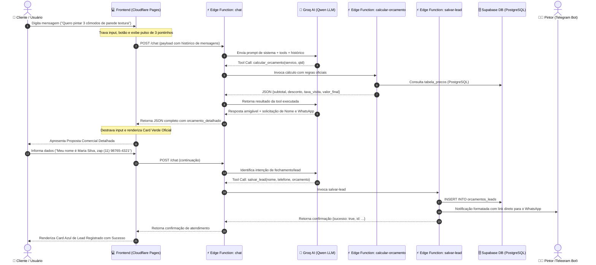

# 🎨 O Orçamento na Hora - Pintura Express

> **Atividade Prática Individual — SENAI-SP**  
> Assistente Inteligente de Orçamento Automatizado com IA, Tool Calling e Notificação Instantânea em Tempo Real.

---

<div align="center">

[](https://orcamento-na-hora.pages.dev/)
[](https://supabase.com)
[](https://groq.com)
[](https://telegram.org)
[](https://sp.senai.br)
[](LICENSE)

**🌐 Produção:** [orcamento-na-hora.pages.dev](https://orcamento-na-hora.pages.dev/) &nbsp;|&nbsp; 
**📋 Painel do Pintor:** [orcamento-na-hora.pages.dev/admin.html](https://orcamento-na-hora.pages.dev/admin.html)

</div>

---

## 📌 Visão Geral da Solução

O **O Orçamento na Hora** é uma solução completa projetada para transformar o atendimento de um pintor autônomo. Utilizando Inteligência Artificial com chamada de ferramentas (**Tool Calling**) e execução em borda (**Supabase Edge Functions**), o sistema interage com o cliente, valida dados, calcula orçamentos oficiais rigorosamente baseados em tabela de preços e dispara leads para o banco de dados e para o **Telegram** do pintor instantaneamente.

### 💰 Regras de Negócio e Preços Oficiais (Invioláveis)
O pintor trabalha exclusivamente com os seguintes valores unitários fixos por cômodo:
* **Parede lisa:** `R$ 120,00` por cômodo
* **Parede com textura:** `R$ 180,00` por cômodo *(maior complexidade e mão de obra)*
* **Teto:** `R$ 100,00` por cômodo

> ⚠️ **Comportamento do Assistente:**  
> O modelo de IA **nunca** calcula valores de cabeça nem inventa preços. O cálculo é delegado via **Tool Calling** para a função `calcular_orcamento`, garantindo exatidão matemática e aderência às regras do negócio. Após apresentar o valor, o assistente solicita Nome e WhatsApp e dispara `salvar_lead`.

---

## 🏛️ Arquitetura do Sistema

A solução opera de maneira desacoplada e modular, garantindo baixa latência, segurança de dados e alta disponibilidade:

```
  +-------------------------------------------------------------------------+
  |                        1. CLIENTE & NAVEGADOR                           |
  |             Cloudflare Pages (HTML5 + Vanilla CSS + JS)                 |
  +-----------------------------------+-------------------------------------+
                                      |  (HTTPS / REST)
                                      v
  +-------------------------------------------------------------------------+
  |                   2. SUPABASE EDGE FUNCTIONS (DENO)                     |
  |                                                                         |
  |   +-------------------+   Tool Calling    +--------------------------+  |
  |   |    /v1/chat       | <===============> | Groq Cloud AI (Qwen LLM) |  |
  |   +---------+---------+                   +--------------------------+  |
  |             |                                                           |
  |             +------------> /v1/calcular-orcamento (Regras & Descontos)  |
  |             |                                                           |
  |             +------------> /v1/salvar-lead (Persistência & Alerta)      |
  +-------------+-----------------------------+-----------------------------+
                |                             |
                v                             v
  +--------------------------+   +------------------------------------------+
  |  3. SUPABASE POSTGRESQL  |   |        4. TELEGRAM BOT API               |
  |  - tabela_precos         |   |  Notificação instantânea no chat         |
  |  - orcamentos_leads      |   |  do pintor Valdir com link WhatsApp      |
  |  - Row Level Security    |   +------------------------------------------+
  +--------------------------+
```

### 🔄 Diagrama de Sequência e Fluxo de Dados (Mermaid)



---

## 🛠️ Tecnologias e Camadas

* **Banco de Dados & RLS:** [Supabase](https://supabase.com) (PostgreSQL gerenciado com Row Level Security habilitado).
* **Backend em Borda:** [Supabase Edge Functions](https://supabase.com/docs/guides/functions) (Deno / TypeScript com headers CORS unificados).
* **Inteligência Artificial:** [Groq Cloud](https://groq.com) com família **Qwen** de alta performance (`qwen-2.5-32b` / `deepseek-r1-distill-qwen-32b`) com Tool Calling nativo.
* **Mensageria & Notificações:** Telegram Bot API (`sendMessage` formatado em HTML com link direto `wa.me`).
* **Frontend:** HTML5 semântico, CSS3 com design moderno claro (Clean White & Slate), responsividade `100dvh` para teclados mobile e JavaScript puro (Vanilla JS).
* **Hospedagem & CDN:** [Cloudflare Pages](https://pages.cloudflare.com) com deploy contínuo global.

---

## 📂 Estrutura de Diretórios

```text
orcamento-na-hora/
├── supabase/
│   ├── migrations/
│   │   └── init.sql                 # Script DDL, tabelas, RLS e dados iniciais
│   └── functions/
│       ├── _shared/
│       │   └── cors.ts              # Configuração de CORS compartilhada
│       ├── calcular-orcamento/
│       │   └── index.ts             # Função Deno de cálculo e validação
│       ├── salvar-lead/
│       │   └── index.ts             # Gravação de lead e disparo no Telegram
│       └── chat/
│           └── index.ts             # Orquestrador Groq (Qwen) + Tool Calling
├── frontend/
│   ├── index.html                   # Interface do chat principal
│   ├── admin.html                   # Painel administrativo do pintor
│   ├── style.css                    # Folha de estilos modernos (Light Mode & 100dvh)
│   ├── app.js                       # Lógica do chat e renderização de cards
│   ├── admin.js                     # Listagem e métricas de leads em tempo real
│   └── config.js                    # Configuração de endpoints (local/cloud)
├── RELATORIO_ENTREGA.md             # Documento oficial de entrega SENAI-SP
├── test_scenarios.js                # Suite de testes automatizados de regressão
├── .env.example                     # Modelo de variáveis de ambiente
└── README.md                        # Guia de configuração, arquitetura e deploy
```

---

## 🚀 Guia de Implantação Passo a Passo

### Passo 1: Configuração do Banco de Dados no Supabase

1. Acesse o painel do seu projeto no [Supabase Dashboard](https://app.supabase.com).
2. Vá até o menu lateral esquerdo e clique em **SQL Editor**.
3. Abra o arquivo [`supabase/migrations/init.sql`](supabase/migrations/init.sql) deste repositório, copie todo o conteúdo e cole no editor do Supabase.
4. Clique em **Run** (Executar).
   * O script criará as tabelas `tabela_precos` e `orcamentos_leads`.
   * Inserirá os 3 preços oficiais (R$ 120, R$ 180 e R$ 100).
   * Habilitará o Row Level Security (RLS) com políticas de leitura pública em preços e escrita pública em leads.

---

### Passo 2: Criando o Bot do Telegram e Obtendo o Chat ID

1. No Telegram, procure pelo usuário oficial **`@BotFather`** e envie `/newbot`.
2. Siga as instruções:
   * Escolha um nome para o bot (ex: `Valdir Pinturas Notifica`).
   * Escolha um username que termine em `bot` (ex: `valdir_pintor_orcamento_bot`).
3. O BotFather fornecerá o token de acesso (exemplo: `7123456789:AAEj4m-xxx-yyy`). Guarde-o como `TELEGRAM_BOT_TOKEN`.
4. Abra uma conversa com o seu novo bot recém-criado e envie a mensagem `/start`.
5. Para descobrir o seu ID de usuário do Telegram:
   * Inicie uma conversa com o bot **`@userinfobot`** no Telegram. Ele responderá imediatamente com o seu `Id` numérico (ex: `123456789`). Guarde-o como `TELEGRAM_CHAT_ID`.
   * *(Alternativa)*: Acesse `https://api.telegram.org/bot<SEU_TOKEN>/getUpdates` no navegador e localize o campo `"id"` dentro do objeto `"chat"`.

---

### Passo 3: Configuração das Variáveis no Supabase (Secrets) e Deploy

Instale o **Supabase CLI** caso ainda não possua:
```bash
npm install -g supabase
```

Faça login e vincule o projeto:
```bash
supabase login
supabase link --project-ref seu-project-id
```

Configure os segredos das Edge Functions:
```bash
supabase secrets set \
  GROQ_API_KEY="gsk_sua_chave_groq_aqui" \
  GROQ_MODEL="qwen-2.5-32b" \
  TELEGRAM_BOT_TOKEN="seu_token_do_telegram" \
  TELEGRAM_CHAT_ID="seu_chat_id"
```

Faça o deploy das 3 Edge Functions:
```bash
supabase functions deploy calcular-orcamento --no-verify-jwt
supabase functions deploy salvar-lead --no-verify-jwt
supabase functions deploy chat --no-verify-jwt
```

*(Nota: a flag `--no-verify-jwt` permite que as requisições públicas do chat frontend alcancem o endpoint sem exigir token JWT de usuário autenticado, utilizando os CORS headers configurados).*

---

### Passo 4: Como Rodar e Testar Localmente

Você pode testar a aplicação localmente:

```bash
# Iniciar o servidor web local na porta 3000
node server.js
```
Abra seu navegador em `http://localhost:3000`.

Para rodar a suite de testes automatizados:
```bash
node test_scenarios.js
```

---

### Passo 5: Deploy do Frontend no Cloudflare Pages

O frontend foi desenvolvido em Vanilla JS sem dependências de compilação, ideal para o Cloudflare Pages:

1. Acesse o [Cloudflare Dashboard](https://dash.cloudflare.com/) e navegue até **Workers & Pages** > **Create application** > **Pages**.
2. Conecte o repositório Git do projeto.
3. Configure os parâmetros da Build:
   * **Framework preset:** `None`
   * **Build command:** *(deixar em branco)*
   * **Build output directory:** `frontend`
4. Clique em **Save and Deploy**.
5. No arquivo `frontend/config.js`, configure a constante `SUPABASE_FUNCTIONS_URL`:
   ```javascript
   SUPABASE_FUNCTIONS_URL: "https://odfvajqnaeodwzaljxzm.supabase.co/functions/v1"
   ```

---

## 🧪 Roteiro de Teste do Atendimento

Experimente simular uma conversa real no chat para verificar todo o fluxo:

1. **Início da conversa:**
   * Cliente: *"Olá, gostaria de saber o valor para pintar 3 cômodos de parede com textura."*
   * **Ação do Assistente:** Aciona a tool `calcular_orcamento` com `{ tipo_servico: "parede_textura", quantidade_comodos: 3 }`.
   * **Resultado Visual:** Renderiza o **Card Verde de Orçamento** exibindo `R$ 180,00` por cômodo e o total exato de `R$ 540,00`.
   * **Mensagem:** Solicita o nome e telefone/WhatsApp do cliente.

2. **Registro do Lead:**
   * Cliente: *"Meu nome é Maria Silva e meu zap é (11) 98765-4321."*
   * **Ação do Assistente:** Aciona a tool `salvar_lead` com os dados completos do orçamento.
   * **Resultado no Banco:** O lead é registrado na tabela `orcamentos_leads`.
   * **Resultado no Telegram:** O bot envia instantaneamente a notificação formatada para o chat do pintor Valdir.
   * **Resultado Visual no Chat:** Renderiza o **Card Azul de Confirmação** informando que os dados foram registrados e o pintor entrará em contato.

---

## 🛡️ Segurança e Boas Práticas Implementadas

* **Row Level Security (RLS):** Protege a tabela `orcamentos_leads` para que outros clientes não possam visualizar os dados confidenciais uns dos outros.
* **Tratamento Resiliente do Telegram:** Caso a API do Telegram esteja instável ou sem sinal, a gravação do lead não é interrompida. O erro é registrado em log e o cliente recebe a confirmação normalmente.
* **CORS Headers:** Módulo centralizado em `_shared/cors.ts` tratando preflight `OPTIONS` para conexões seguras entre o Cloudflare Pages e o Supabase.
* **Prompt Engineering:** System Prompt com diretrizes estritas que eliminam alucinações e proíbem cálculos manuais pela IA.

---

## 👨‍💻 Autor & Identificação Acadêmica

* **Aluno:** **MATHEUS HENRIQUE DE OLIVEIRA COSTA**
* **Instituição:** **SENAI-SP**
* **Projeto:** Atividade Prática Individual — *O Orçamento na Hora*
* **Link em Produção:** [https://orcamento-na-hora.pages.dev/](https://orcamento-na-hora.pages.dev/)
* **Painel Administrativo:** [https://orcamento-na-hora.pages.dev/admin.html](https://orcamento-na-hora.pages.dev/admin.html)
* **Repositório GitHub:** [https://github.com/matheuhenriqu/orcamento-na-hora](https://github.com/matheuhenriqu/orcamento-na-hora)
