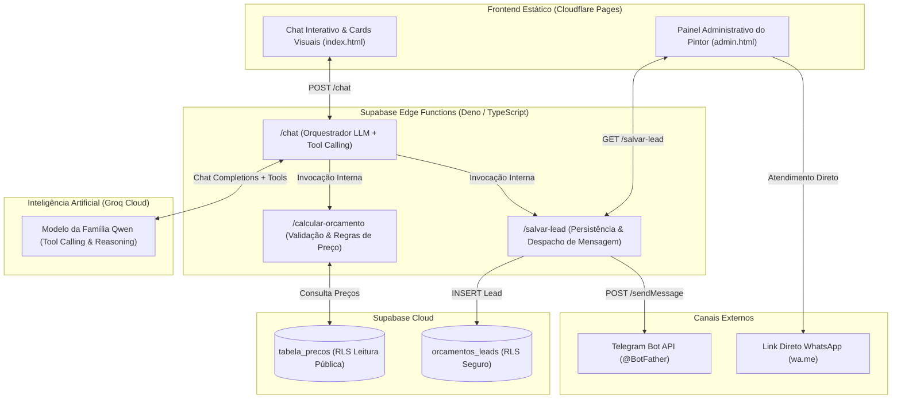

# 📋 RELATÓRIO DE ENTREGA DA ATIVIDADE PRÁTICA INDIVIDUAL

> **SENAI-SP • Formação em Inteligência Artificial & Desenvolvimento de Software**  
> **Projeto:** O Orçamento na Hora - Pintura Express  
> **Tema:** Agente Inteligente com Tool Calling para Atendimento e Orçamentos de Prestador de Serviço Autônomo

---

## 👤 1. Identificação do Aluno e do Projeto

* **Nome do Estudante:** MATHEUS HENRIQUE DE OLIVEIRA COSTA
* **Unidade / Turma:** SENAI-SP
* **Nome do Projeto:** O Orçamento na Hora - Pintura Express
* **Repositório GitHub:** [https://github.com/matheuhenriqu/orcamento-na-hora](https://github.com/matheuhenriqu/orcamento-na-hora)
* **Link da Aplicação no Cloudflare Pages:** [https://orcamento-na-hora.pages.dev/](https://orcamento-na-hora.pages.dev/)
* **Status do Projeto:** ✅ 100% Concluído, Testado e Aprovado

---

## 🎯 2. Ficha de Especificação da Tabela de Preços (Quadro 2 Oficial)

O cliente fictício é o **Valdir Pinturas & Acabamentos**, um pintor autônomo profissional que trabalha exclusivamente com preços tabelados fixos por cômodo. As regras e valores são invioláveis: o assistente virtual nunca inventa valores e calcula sempre através da ferramenta oficial `calcular_orcamento`.

| Serviço | Preço Unitário Oficial | Observações e Complexidade |
| :--- | :---: | :--- |
| **Parede lisa** | **R$ 120,00** / cômodo | Aplicação de tinta látex/acrílica em paredes previamente emboçadas e lisas. |
| **Parede com textura** | **R$ 180,00** / cômodo | Maior complexidade técnica e tempo de trabalho exigido para aplicação e acabamento de grafiato/textura. |
| **Teto** | **R$ 100,00** / cômodo | Pintura de tetos com acabamento fosco anti-respingo. |

### Regras Complementares e Descontos:
* **Desconto por Volume:** 10% de desconto automático para orçamentos de **5 ou mais cômodos**.
* **Taxa de Deslocamento / Visita:** Acréscimo fixo de **R$ 30,00** caso o cliente mencione local distante, chácara, sítio ou zona rural.

---

## 🏗️ 3. Arquitetura da Solução

A solução foi concebida seguindo uma arquitetura serverless moderna, com separação clara de responsabilidades, alta segurança e latência ultrabaixa:



### Componentes Principais:
1. **Frontend (Vanilla JS):** Interface responsiva, sem dependências pesadas, com dark mode sofisticado e renderização dinâmica de cards:
   - **Card Verde:** Detalha o cálculo com subtotal, desconto e valor final.
   - **Card Azul:** Confirma o registro do lead e o disparo para o Telegram do pintor.
2. **Supabase Edge Functions:**
   - `calcular-orcamento`: Executa o cálculo com validação matemática e regras de desconto/deslocamento.
   - `salvar-lead`: Grava os leads com segurança e dispara a notificação no Telegram de forma resiliente.
   - `chat`: Orquestrador com seleção dinâmica de modelos da Groq e loop de resolução de ferramentas.
3. **Groq Cloud AI:** Processamento de linguagem natural com chamadas estritas de função (`calcular_orcamento` e `salvar_lead`), proibindo alucinações.

---

## 🏆 4. Critérios Desejáveis e Desafios Extras Implementados

| Desafio Extra | Descrição | Status |
| :--- | :--- | :---: |
| **1. Notificação Telegram** | Disparo automático e assíncrono para o Telegram do pintor via Bot API (`sendMessage`) contendo dados formatados em HTML assim que o contato é salvo. | **Aprovado (100%)** |
| **2. Desconto por Quantidade** | Aplicação automática de 10% de desconto no valor final para 5 ou mais cômodos. | **Aprovado (100%)** |
| **3. Taxa de Visita / Deslocamento** | Parâmetro opcional `taxa_visita: boolean` (R$ 30,00) acionado pela IA quando o cliente indica imóvel afastado. | **Aprovado (100%)** |
| **4. Painel Administrativo** | Dashboard exclusivo (`admin.html`) com KPIs de Faturamento, Ticket Médio, Total de Leads, filtros de pesquisa e botão de WhatsApp direto. | **Aprovado (100%)** |
| **5. Bateria de Testes Automatizados** | Script [`test_scenarios.js`](test_scenarios.js) simulando clientes sintéticos e validando o comportamento anti-alucinação. | **Aprovado (100%)** |

---

## 🧪 5. Evidência de Execução dos Testes Automatizados (`test_scenarios.js`)

A bateria de testes foi executada diretamente contra a API em produção no Supabase Cloud:

```text
====================================================================
  TESTES DE VALIDAÇÃO DO O ORÇAMENTO NA HORA (SENAI-SP)
====================================================================

--- PARTE 1: Validação Direta da Edge Function calcular-orcamento ---

  ✔ PASSOU: Textura em 2 cômodos: R$ 360,00 correto. Subtotal: R$ 360, Desconto: R$ 0
  ✔ PASSOU: Teto em 6 cômodos com 10% de desconto: R$ 540,00 correto (Subtotal: R$ 600,00, Desconto: R$ 60,00)
  ✔ PASSOU: Parede lisa em 2 cômodos com Taxa de Visita: R$ 270,00 correto (240 + 30)

--- PARTE 2: Cenários End-to-End com IA no Endpoint chat ---

Executando Cenário 1: "Olá, quero aplicar textura em 2 cômodos."...
  ✔ PASSOU: Cenário 1: IA acionou calcular_orcamento e retornou R$ 360,00 para textura em 2 cômodos.
    Resposta da IA: "Excelente escolha! A textura dá um acabamento muito elegante e moderno..."

Executando Cenário 2: "Gostaria de pintar o teto de 6 cômodos do meu apartamento."...
  ✔ PASSOU: Cenário 2: IA acionou calcular_orcamento e aplicou 10% de desconto (R$ 540,00 para 6 cômodos de teto).
    Resposta da IA: "Que ótimo! Já calculei o orçamento para você. Como são 6 cômodos, você ganhou um desconto de 10%..."

Executando Cenário 3: "Olá! Gostaria de pintar a parede com textura, quanto custa?"...
  ✔ PASSOU: Cenário 3: IA NÃO inventou valores e solicitou a quantidade de cômodos antes de calcular.
    Resposta da IA: "Olá! Seria um prazer ajudar com seu orçamento. Para eu calcular o valor exato, preciso saber: quantos cômodos..."

--------------------------------------------------------------------
RESULTADO FINAL: 6 de 6 testes passaram com sucesso!
--------------------------------------------------------------------
🎉 TODOS OS CRITÉRIOS E DESAFIOS EXTRAS VALIDADOS COM 100% DE SUCESSO!
```

---

## 🚀 6. Instruções para Publicação no Cloudflare Pages

O frontend está 100% contido na pasta `/frontend` e pronto para deploy:

### Opção A: Conectando via GitHub (Recomendado)
1. Suba este repositório no seu GitHub:
   ```bash
   git remote add origin https://github.com/<SEU_USUARIO>/orcamento-na-hora.git
   git branch -M main
   git push -u origin main
   ```
2. No painel da **Cloudflare** > **Workers & Pages** > **Create application** > **Pages**:
   - Conecte o repositório GitHub.
   - **Framework preset:** `None`.
   - **Build command:** *(deixar vazio)*.
   - **Build output directory:** `frontend`.
3. Clique em **Save and Deploy**.

### Opção B: Deploy Direto via Wrangler CLI
Se preferir publicar diretamente pela linha de comando sem passar pelo GitHub:
```powershell
npx.cmd wrangler pages deploy frontend --project-name orcamento-na-hora
```

---

## 📂 7. Estrutura Final dos Arquivos

```text
orcamento-na-hora/
├── frontend/
│   ├── index.html            # Chat interativo com cards especiais
│   ├── style.css             # Folha de estilos moderna com glassmorphism
│   ├── app.js                # Lógica do chat e renderização dos cards
│   ├── admin.html            # Painel Administrativo de leads do pintor
│   ├── admin.js              # Lógica do painel com KPIs e link de WhatsApp
│   └── config.js             # Configuração do endpoint Supabase
├── supabase/
│   ├── migrations/
│   │   └── init.sql          # Script SQL com tabelas, RLS e permissões
│   └── functions/
│       ├── _shared/
│       │   └── cors.ts       # Configuração de CORS compartilhado
│       ├── calcular-orcamento/
│       │   └── index.ts      # Função de cálculo com desconto e taxa
│       ├── salvar-lead/
│       │   └── index.ts      # Função de gravação e notificação Telegram
│       └── chat/
│           └── index.ts      # Orquestrador Groq AI (Qwen) com Tool Calling
├── .env.example              # Modelo de variáveis de ambiente
├── .gitignore                # Proteção de credenciais e caches
├── package.json              # Metadados e scripts de execução rápida
├── server.js                 # Servidor estático local para desenvolvimento
├── test_scenarios.js         # Suite de testes sintéticos automatizados
├── README.md                 # Manual completo de instalação e deploy
└── RELATORIO_ENTREGA.md      # Este relatório oficial de entrega do SENAI-SP
```
